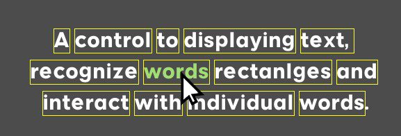

# InteractParagraph
The source code and sample for GODOT UI control to display single-paragraph text, recognize on-screen words locations and interact (hit-testing) individual words.

## Features

- Automatically generate rectangle for each word to be used for hit-testing.
- Allows specifying distinct color for each word or character range.
- Supports aligning the text horizontally or vertically within control area.
- Supports line spacing.
- Right-to-left direction is supported.


## Sample
### word_color scene

Shows how to setup an InteractParagraph in the editor, and how to interact with individual words at run-time.

## Key methods Reference

#### Get word at specific screen coordinates
```
  .get_word_rect_at(pos: Vector2)-> WordRectInfo
```

#### Set word color
```
  .set_word_rect_color(wordRect: WordRectInfo, color: Color)-> void:
```

#### Set character range color
```
  .set_color_range(start: int, end: int, color: Color)-> void:
```

## Acknowledgements

 - [Inspiring Reddit post by mrcdk](https://www.reddit.com/r/godot/comments/1987awg/how_to_get_the_world_position_of_a/)
 

## Authors

- [@Fadi-git](https://github.com/Fadi-git)


## Badges

[](https://choosealicense.com/licenses/mit/)


